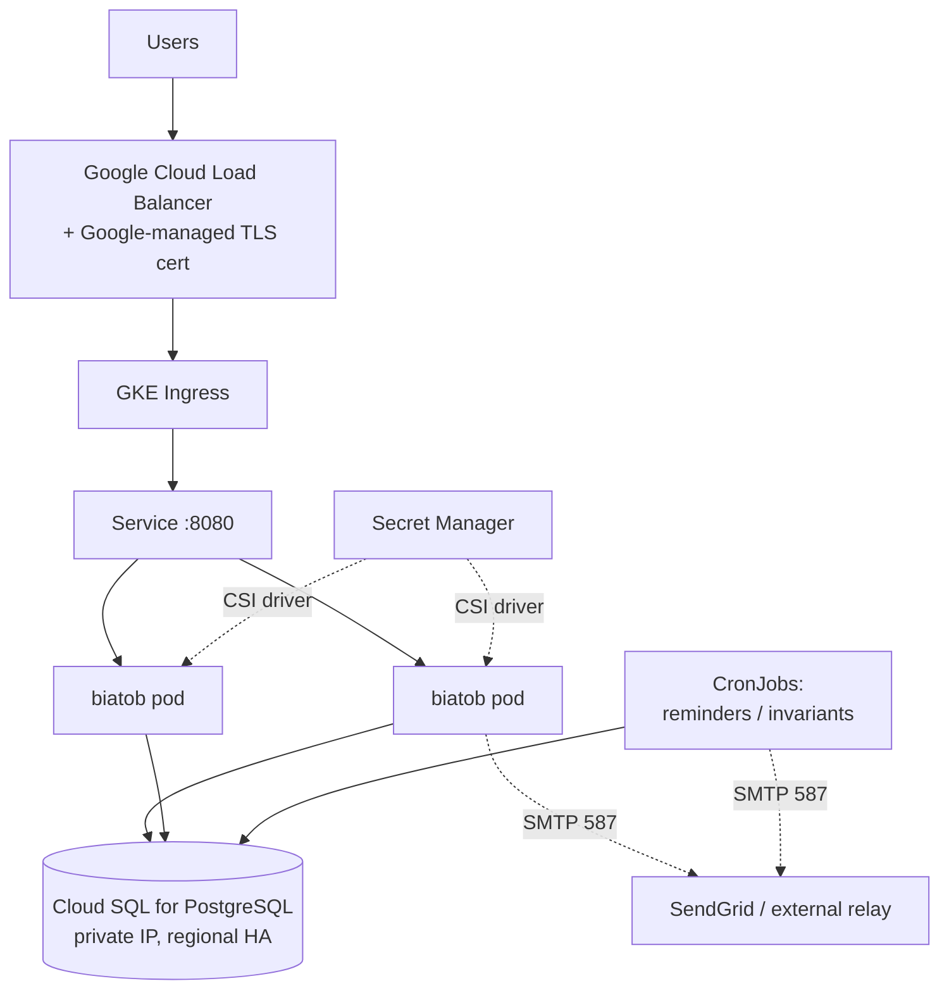

# Running biatob on GCP: GKE + Helm + Cloud SQL for PostgreSQL

A high-level sketch, written against the code as of `64ca44d`. Nothing here is implemented
yet; the point is to lay out the target architecture and, more importantly, to be honest
about the code changes that have to land before any of it works.

## Target architecture



Concretely:

- **Artifact Registry** holds the image. Multi-stage build: stage one runs `protoc`
  (+ `protoc-gen-elm` from npm) and `elm make`; stage two is a slim Python image with only
  `server/requirements.txt` installed plus the built `elm/dist`, `server/static/`, and the
  two checked-in font files. None of the Elm/npm/protoc toolchain belongs in the runtime layer.
- **GKE Autopilot** rather than Standard. This is one small stateless web app; there's no
  reason to be managing node pools.
- **Cloud SQL for PostgreSQL**, private IP, regional HA, automated backups. Reached via the
  Cloud SQL Auth Proxy as a sidecar, with Workload Identity so the pod authenticates as a
  GCP service account rather than carrying a DB password.
- **Ingress** via GKE's native Ingress → Cloud Load Balancer, with a `ManagedCertificate`
  for TLS. This retires the NearlyFreeSpeech proxy *and* the `/home/public/.well-known`
  ACME route (`web_server.py:117-123`), which is dead code the moment Google manages certs.
- **Logging** needs no work: `structlog` already renders JSON to stdout (`main.py:25-35`),
  which Cloud Logging picks up and parses for free.

## Helm chart shape

```
charts/biatob/
  Chart.yaml
  values.yaml            # image tag, replicas, hostname, cloudsql instance, cron toggles
  templates/
    deployment.yaml      # web pods + cloudsql-proxy sidecar
    service.yaml
    ingress.yaml         # + ManagedCertificate, BackendConfig (health check path)
    secret-provider.yaml # SecretProviderClass → mounts credentials textproto
    cronjob-reminders.yaml
    cronjob-invariants.yaml
    job-migrate.yaml     # pre-upgrade hook; see "Migrations" below
  values-staging.yaml    # --mock-out-emails, single replica, non-HA db
  values-prod.yaml
```

Environments differ by values file only. Staging gets `--mock-out-emails` (`main.py:57-64`),
which is genuinely useful here — it means a staging deploy can't email real users.

## Config and secrets

This part is unusually clean, and we should not "modernize" it. All config lives in a single
protobuf-text file passed as `--credentials-path` (`main.py:42,55`): SMTP creds, the
`token_signing_secret` HMAC key, and `database_info`. The app reads **zero** environment
variables.

That maps perfectly onto a file-mounted secret. Store the whole rendered
`CredentialsConfig.textproto` as one Secret Manager secret, mount it with the Secret Manager
CSI driver at `/etc/biatob/credentials.textproto`, point `--credentials-path` at it. No code
change, no env-var refactor, no 12-factor rewrite. The one wrinkle: Cloud SQL IAM auth wants
to *not* have a password in that file, so with the Auth Proxy sidecar the config points at
`127.0.0.1:5432` and the password field carries the IAM token or goes unused.

## The prerequisites — what has to change in the code first

Roughly in descending order of how much they'd hurt to discover late.

**1. There is no PostgreSQL support at all.** `get_db_url` (`sql_schema.py:116-119`) handles
exactly two cases, SQLite and MySQL, and asserts on anything else. The proto oneof
(`protobuf/mvp.proto:13-24`) only has `sqlite` and `mysql` variants. So "use Cloud SQL
Postgres" means: add a `postgres` variant to `DatabaseInfo`, add a URL branch, add a driver
(`psycopg2-binary` or `pg8000`) to requirements.

The saving grace, and it's a big one: **there is not a single line of raw SQL in the
servicer** — zero `sqlalchemy.text()` calls in `sql_servicer.py`; it's all SQLAlchemy Core
query builders, which are dialect-agnostic. The only genuinely MySQL-flavored thing in the
schema is `VARBINARY(255)` on `passwords.salt`/`passwords.scrypt` (`sql_schema.py:17-18`),
which becomes `LargeBinary`. So this port is a day's work, not a quarter's. It'd be worth
running the existing test suite against a Postgres container to confirm.

**2. The database connection will not survive Cloud SQL.** `main.py:77` does
`create_engine(...).connect()` once at startup and holds that single `Connection` for the
process's entire life. There is no pool checkout per request and no reconnect logic. Cloud
SQL restarts for maintenance; the proxy drops idle connections. Today's SQLite-on-local-disk
setup never exposed this. Under GKE the app would wedge until someone restarted the pod.
This is the real blocker — it needs a per-request `engine.connect()` (or at minimum
`pool_pre_ping=True`), and it touches how every servicer method gets its connection.

**3. Background jobs force `replicas: 1` as things stand.** Three `asyncio` loops start
in-process (`main.py:93-105`, `sql_servicer.py:1209-1253`): hourly resolution reminders,
hourly invariant checks, daily backup. N replicas means N pods racing to send the same
reminder emails and N copies of the backup email. Either pin to one replica (fine at
current traffic, honestly) or add flags to disable the in-process loops and extract them
into Helm-managed `CronJob`s. The CronJob route is the reason the chart above lists them.

Note the daily backup job (`sql_servicer.py:1195-1207`) dumps the whole DB to JSON and
*emails it* — that's the current backup mechanism. On Cloud SQL, automated backups and PITR
replace it outright; delete the job rather than porting it.

**4. No health endpoint exists.** Nothing matches `health`/`ready`/`live` anywhere in
`server/`. Probes and the Ingress `BackendConfig` both need one, and we can't lean on an
existing route: `GET /` 307-redirects (`web_server.py:132`) and there's a catch-all
`GET /{username}` (`web_server.py:327`) that will happily swallow whatever path we pick. Add
a real `/healthz` that checks the DB connection.

**5. Migrations are a manual process.** Alembic was deliberately removed (`b375513`,
"resign self to hand-coding database migrations"); `metadata.create_all()` runs only in
tests (`test_utils.py:51`). The leftover `alembic.ini` at the repo root is dead weight.
A hand-run-SQL workflow that was tolerable with one ssh host gets meaningfully worse when
the DB is only reachable from inside the VPC. Minimum viable answer: a Helm `pre-upgrade`
hook Job that runs versioned SQL from a ConfigMap. Better answer: reintroduce migration
tooling. Worth deciding deliberately rather than by default — it's the piece of this plan
I'd most want your read on, since it was a deliberate call to drop it.

**6. Old pins constrain the base image.** `aiohttp==3.7.3` and `protobuf==3.14.0` are
2020-vintage and won't build on Python 3.11+. Either pin the runtime image to Python 3.9 or
bump deps as part of this work. Meanwhile `Pillow==10.3.0` must *stay* — `64ca44d` moved
`web_server.py:70` to `font.getbbox()`, which Pillow 9 doesn't have. The dep bump and the
image build are coupled; expect to do them together.

**7. `--elm-dist` is a lie.** The flag is parsed and stored (`web_server.py:93`) but
`get_elm_module` (`web_server.py:125-128`) hardcodes `_HERE.parent/'elm'/'dist'`. So the
image must preserve the repo's directory layout (`/app/server`, `/app/elm/dist`), or we fix
the handler. Trivial either way, but it'll bite whoever writes the Dockerfile expecting the
flag to work.

## Things that are already fine

Worth saying explicitly, because it's more than I expected going in:

- **Nothing writes to local disk at runtime.** The embed PNGs (`web_server.py:68-80`) are
  rendered in-memory by PIL and never persisted; the fonts are read-only checked-in files.
  No PVCs needed anywhere.
- **Auth is stateless** — HMAC-signed cookies (`core.py:163-175`), no server-side sessions.
  Horizontal scaling is a non-issue once the cron jobs are dealt with.
- **Logs are already structured JSON** to stdout.

The one caching wrinkle: embed images use an in-process `functools.lru_cache(maxsize=256)`
(`web_server.py:67`), so the hit rate drops with each added replica and resets on every
deploy. Not a correctness problem — these are cheap to render — but if the badges get hot,
the CDN on the Cloud Load Balancer is the natural fix, which needs cache headers that
`stupid_file_response` (`web_server.py:82-87`) doesn't currently set.

## Suggested sequencing

1. Postgres support + run the test suite against Postgres. (Independent of GCP; do it first.)
2. Fix the DB connection lifecycle. **The actual blocker.**
3. Add `/healthz`; add flags to disable in-process cron loops.
4. Dockerfile (multi-stage) + Artifact Registry + CI build.
5. Terraform the GCP side: project, VPC, GKE Autopilot, Cloud SQL, Secret Manager, Workload Identity.
6. Helm chart; deploy to staging with `--mock-out-emails`.
7. Migrate data (`pg_loader` or a dump/load script from the existing DB), cut DNS, retire NFS.

Steps 1–3 are ordinary Python work with no GCP involved, and they're most of the risk. The
Kubernetes and Helm layers are comparatively boring — which is the right shape for this to
have.

## Open questions

- **Migrations**: reintroduce tooling, or Helm-hook Jobs running hand-written SQL? Dropping
  Alembic was deliberate, so I'd rather ask than assume.
- **Cost**: Autopilot + regional-HA Cloud SQL is meaningfully more expensive than NFS
  shared hosting — plausibly ~$100+/month vs a few dollars. Zonal Cloud SQL and a
  single small instance cut that a lot. Is HA actually wanted here?
- **SMTP**: GCP blocks outbound port 25. Current SMTP config (`mvp.proto:29-35`) has a port
  field, so this is config-only *if* the provider supports 587 — worth confirming which
  relay we'd point at.
- **Replicas**: is horizontal scaling actually a goal, or is `replicas: 1` plus fast restarts
  fine? If the latter, prerequisite #3 shrinks to "leave the loops alone" and the CronJobs
  disappear from the chart.
